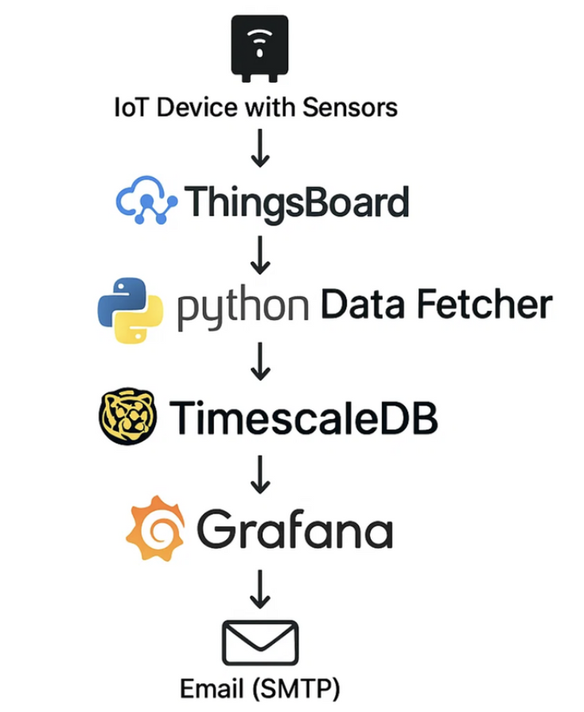
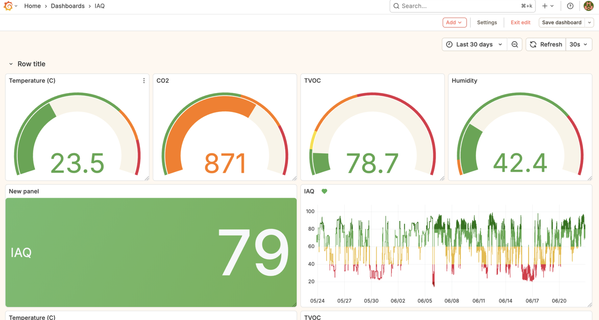
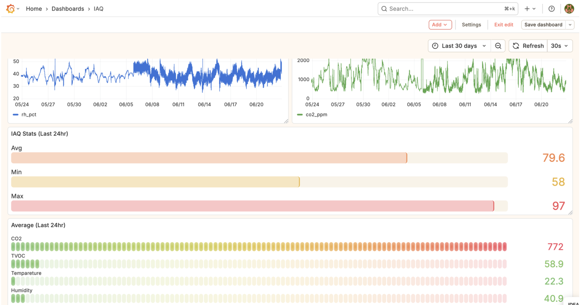
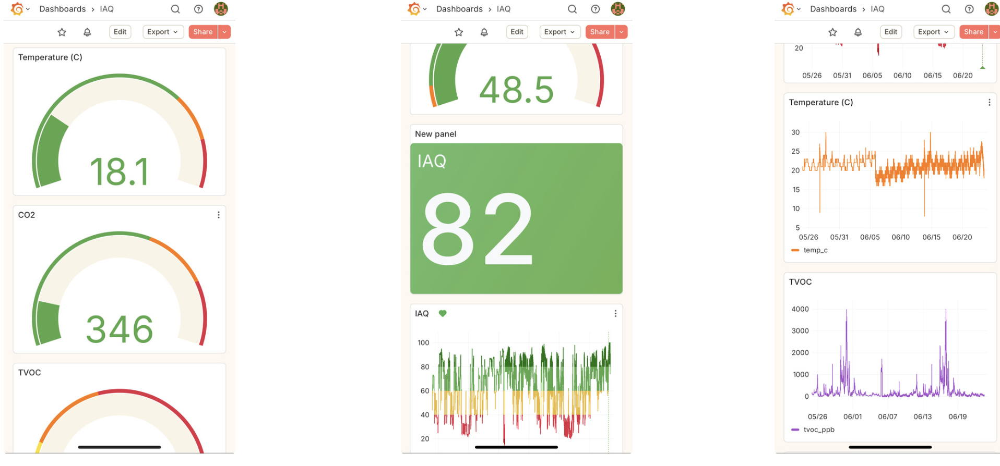

# IAQ Pipeline

A real-time Indoor Air Quality (IAQ) monitoring pipeline that collects sensor data, calculates IAQ scores, stores data in TimescaleDB, and visualizes metrics in Grafana.

## Overview

This project provides a complete solution for monitoring indoor air quality by:
- Polling sensor data from an API endpoint
- Calculating comprehensive IAQ scores based on multiple environmental factors
- Storing time-series data in TimescaleDB (PostgreSQL extension)
- Visualizing data through Grafana dashboards
- Getting Email Alerts (SMTP)

## Features

- **Real-time Data Collection**: Polls sensor API every 22 seconds (configurable)
- **IAQ Score Calculation**: Composite score based on:
  - CO₂ levels (ppm)
  - Temperature (°C)
  - Relative Humidity (%)
  - Total Volatile Organic Compounds (TVOC) in ppb
- **Time-Series Storage**: Uses TimescaleDB for efficient time-series data management
- **Data Visualization**: Grafana integration for real-time dashboards
- **Docker-based**: Easy deployment with Docker Compose
- **Automatic Retry**: Handles API and database connection failures gracefully

## Prerequisites

- Docker and Docker Compose
- Python 3.8+ (for data ingestion script)
- uv (Python package manager) - can be installed via pip

## Quick Start

1. **Clone the repository**
   ```bash
   git clone <repository-url>
   cd iaq_pipeline
   ```

2. **Configure environment variables**
   ```bash
   cp .env.example .env
   ```
   Edit `.env` with your credentials:
   - Database credentials
   - VizHub API credentials (if using VizHub)
   - Device ID and API host

3. **Start the stack**
   ```bash
   ./setup.sh
   ```
   This script will:
   - Start TimescaleDB and Grafana containers
   - Create the database and enable TimescaleDB extension
   - Create the `iaq_measurements` table

4. **Install Python dependencies**
   ```bash
   pip install uv
   ```

5. **Run the data ingestion pipeline**
   ```bash
   uv run final.py
   ```

## Architecture



## Configuration

### Environment Variables

| Variable | Description | Default |
|----------|-------------|---------|
| `POSTGRES_PASSWORD` | PostgreSQL password | changeme |
| `POSTGRES_USER` | PostgreSQL username | postgres |
| `POSTGRES_DB` | Database name | iaq |
| `VIZHUB_LOGIN` | VizHub login email | - |
| `VIZHUB_PW` | VizHub password | - |
| `DEVICE_ID` | Sensor device ID | - |
| `API_HOST` | API endpoint URL | - |
| `PG_HOST` | PostgreSQL host | localhost |
| `PG_PORT` | PostgreSQL port | 5432 |
| `TABLE_NAME` | TimescaleDB table name | iaq_measurements |
| `POLL_SEC` | Polling interval in seconds | 22 |

### Services

- **TimescaleDB**: Runs on port 5432
- **Grafana**: Accessible at http://localhost:3000 (default login: admin/admin)

## Database Schema

The `iaq_measurements` table stores:

| Column | Type | Description |
|--------|------|-------------|
| `time` | TIMESTAMPTZ | Measurement timestamp (primary key) |
| `device_id` | TEXT | Device identifier (primary key) |
| `temp_c` | DOUBLE PRECISION | Temperature in Celsius |
| `rh_pct` | DOUBLE PRECISION | Relative humidity percentage |
| `co2_ppm` | DOUBLE PRECISION | CO₂ concentration in ppm |
| `tvoc_ppb` | DOUBLE PRECISION | TVOC concentration in ppb |
| `iaq_score` | INTEGER | Calculated IAQ score (0-100) |


## Grafana Setup

1. Access Grafana at http://localhost:3000
2. Login with admin/admin (change password on first login)
3. Add TimescaleDB as a data source:
   - Host: `timescaledb:5432`
   - Database: `iaq`
   - User: `postgres`
   - Password: (from .env)
4. Import dashboards or create custom visualizations

## Screenshots

## Application Screenshot




